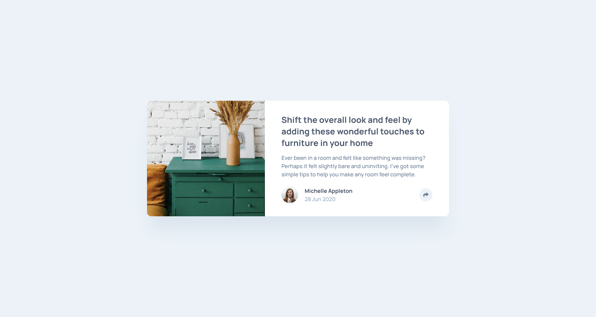
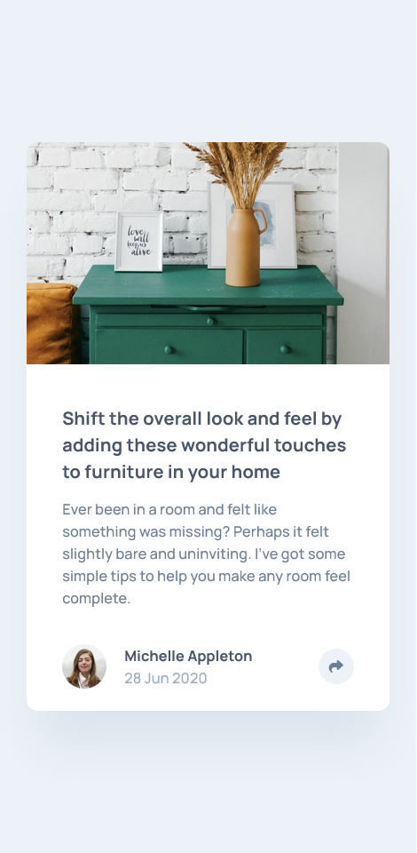

# Frontend Mentor - Article preview component solution


This is a solution to the [Article preview component challenge on Frontend Mentor](https://www.frontendmentor.io/challenges/article-preview-component-dYBN_pYFT). Frontend Mentor challenges help you improve your coding skills by building realistic projects.

## Table of contents

- [Frontend Mentor - Article preview component solution](#frontend-mentor---article-preview-component-solution)
  - [Table of contents](#table-of-contents)
  - [Overview](#overview)
    - [The challenge](#the-challenge)
    - [Screenshot](#screenshot)
    - [Links](#links)
  - [My process](#my-process)
    - [Built with](#built-with)
    - [What I learned](#what-i-learned)
    - [Continued development](#continued-development)
    - [Useful resources](#useful-resources)
  - [Author](#author)
  - [Acknowledgments](#acknowledgments)

## Overview

### The challenge

Users should be able to:

- View the optimal layout for the component depending on their device's screen size
- See the social media share links when they click the share icon

### Screenshot




### Links

- Solution URL: [GitHub](https://github.com/newbpydev/12-article-preview-component-react-ts-scss)
- Live Site URL: [Netlify](https://gentle-scone-d0f545.netlify.app/)

## My process

### Built with

- Semantic HTML5 markup
- SCSS
- Flexbox
- Mobile-first workflow
- [React](https://reactjs.org/) - JS library
- [Sass](https://sass-lang.com/) - For styles

### What I learned

I have learned that there are different ways of approaching the same problem. On
the following sample code I used a combination of styles, such as using the
power of React to conditionally render some styles based on a button status. In
the styles I used the properties `object-fit` and `object-position` which are
new to me. I will continue to explore what is possible in SCSS even further on
the next projects.

```html
 <button
  className={styles["article-card__share-button"]}
  style={{
    backgroundColor: shareButtonIsActive
      ? "var(--blue-desaturated-dark)"
      : "",
  }}
  title="click to share on social media"
  onClick={handleClick}
>
  <i
    className={"fa-solid fa-share "}
    style={{ color: shareButtonIsActive ? "white" : "" }}
  ></i>
</button>
```

```scss
&__picture-frame {
  width: 100%;
  height: 20rem;
  overflow: hidden;

  @media (min-width: 64em) {
    height: 100%;
    min-width: 28.5rem;
    position: relative;
    border-top-left-radius: 1rem;
    border-bottom-left-radius: 1rem;
  }
}

&__img {
  width: 100%;
  height: auto;
  object-position: 0rem -1.7rem;

  @media (min-width: 64em) {
    width: 100%;
    height: 100%;
    object-fit: cover;
    object-position: 0rem 0rem;
  }
}
```

```js
const renderShareButtons = shareButtonIsActive ? (
  window.innerWidth < 1024 ? (
    <SocialPopUp onClickHandler={handleClick} />
  ) : (
    <>
      <SocialPopUp onClickHandler={handleClick} />
      {renderAuthor}
    </>
  )
) : (
  renderAuthor
);
```

### Continued development

On this challenge, I had some issues with my image positioning, I noticed that
the design has a very specific set view on the available space, so I had to
explore on the different ways to make this effect work. I now know that I will
have to expand my knowledge image positioning. On my next challenges I will try
to apply some of the other techniques that I learned on this journey.

### Useful resources

- [Font Awesome - Setup](https://fontawesome.com/docs/web/setup/packages) - For those using npm or yarn package managers, you can use the Font Awesome packages to easily keep your project up-to-date with the latest icons and improvements.
- [W3Schools - CSS3 Images](https://www.w3schools.com/css/css3_images.asp) -
  W3Schools is a great place to get some ideas on how an element, or in this
  case the css for the image, can be set to get the desired effect.

## Author

- Website - [Juan Gomez](https://github.com/newbpydev)
- Frontend Mentor - [@newbpydev](https://www.frontendmentor.io/profile/newbpydev)
- Twitter - [@Newb_PyDev](https://twitter.com/Newb_PyDev)

## Acknowledgments

The code may not be perfect compared to my sensei @jonasschmedtman but I need to
thank him because he has shown me the ropes and now I am a confident web
designer.
